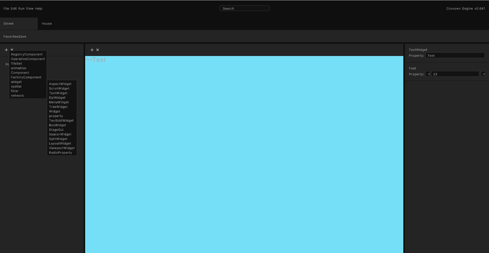
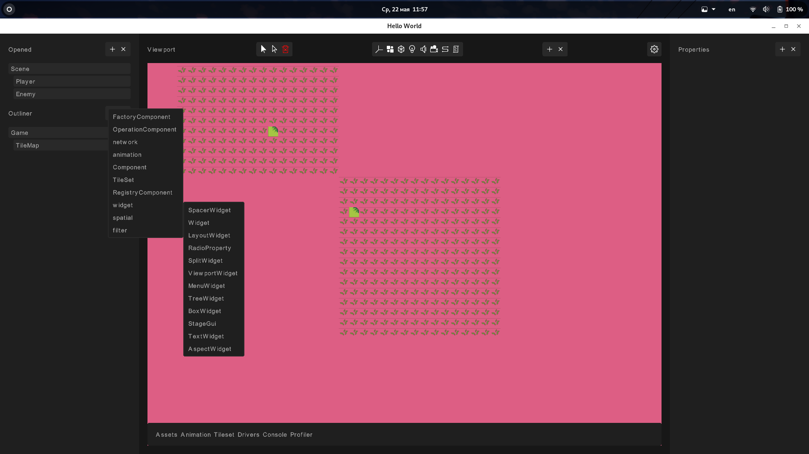
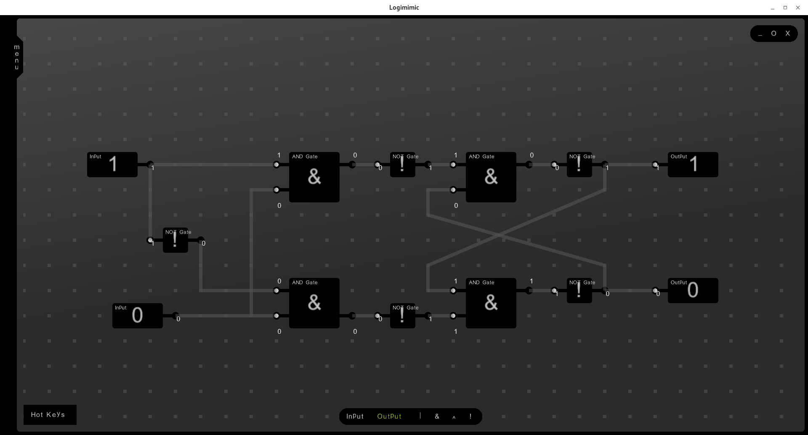
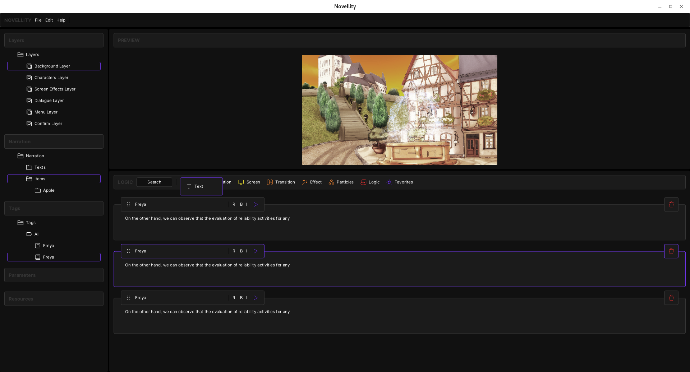
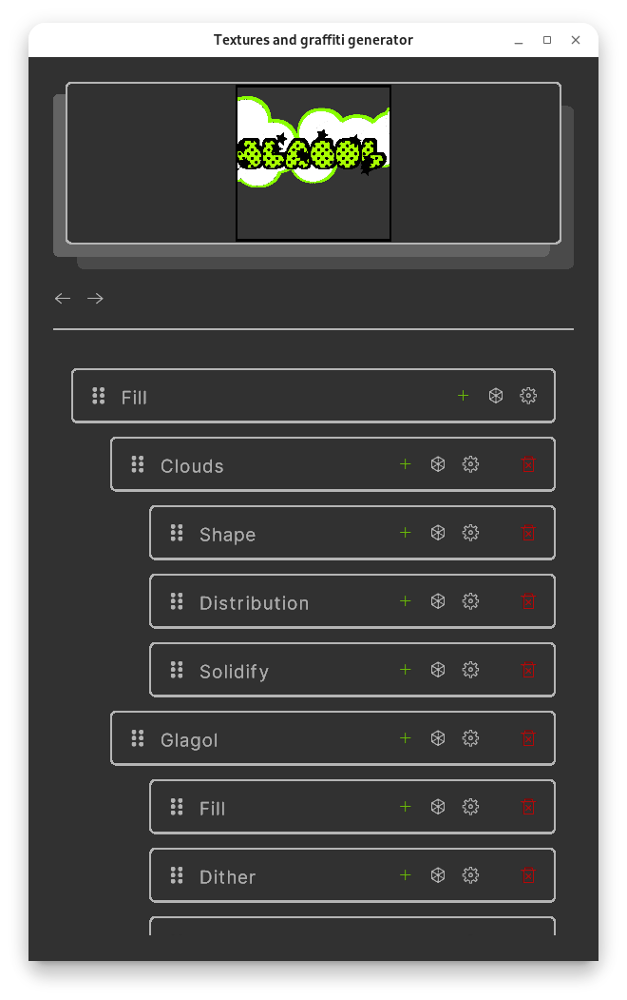
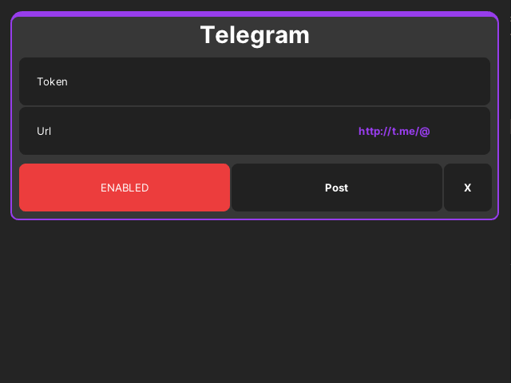

# Crovown

Crovown is a modern cross-platform Game/GUI framework with an editor built on top of it. Inspired by `Figma` and `Adobe Flash`. The result looks consistent across all targets!

The goal of this project is to make an engine that allows to run it everywhere from Windows, Linux, Android and consoles to Unity, UE5, Blender, etc as its backend. Crovown have friendly API inspired by `Flutter` and `Swift`. Also I want to replace wonderful `Scaleform UI` and extend its functionality. For that purpose I choose Haxe because of its portability and cross-platform libraries such as Lime and Kha. For Unity, UE5 and Blender I will made my own backends.

I have high hopes for Blender, because Crovown will allow you to develop handy HUDs for addons (and even games inside them!). For UE5 and Unity Crovown will allow you to make complex GUIs which looks the same across all targets. Also Crovown will have additional possibilities such SVG support.

Crovown supports built in undo/redo system, just mark your class variable with @:p metadata! @:p metadata also enables serialization/deserialization and data binding system via signals. Network (and Tree widget) is implemented by tree structure/data synchronization.

## Current state

Current state of this project is pre-pre-pre-alpha-alpha-alpha, so, yeah, it is far from release, however I have two public repositories `Tagg` and `Logimimic` which uses this framework, you can download and run them (for windows use html5 version)!

API will be changed after refactor.

## Already implemented components

Widgets:

- Aspect widget
- Box widget (with Fixed/Scale/Center anchors)
- DPI widget
- Layout widget (with flexible layout and Hug/Fill policy)
- Menu widget
- Radio property
- Scroll widget
- Spacer widget
- Split widget
- Text edit widget
- Text widget
- Tree widget (much much easier to use than in QT and other libraries!)
- Viewport widget
- regular Widget

Filters

- Blur filter
- Outline filter

Animations

- Animation (property animation)
- Sequence animation

Spatial

- Tilemap

Network

- Network component

Other

- Factory component
- Operation component
- Registry component
- Tileset

## Screenshots

